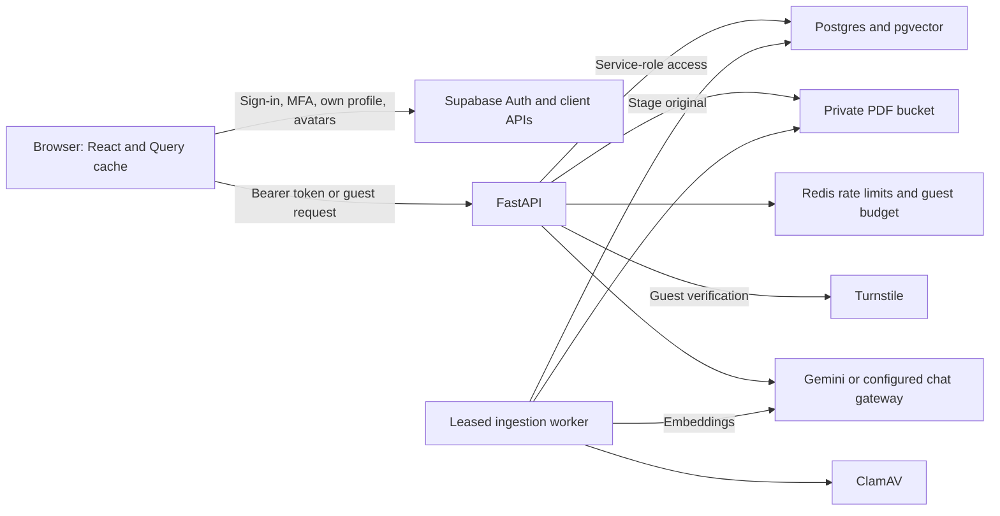

# Codebase and security audit — 2026-09-05

Reviewed commit: `1426252313b11b6015520cef7d74cba696ab28f6`.

The application has substantial authorization, ingestion, and testing infrastructure, but the passing quality gates do not establish that it is ready to handle sensitive institutional data. This review reproduced a disclosure of cached data between accounts, unauthenticated upload resource consumption, and two data-loss paths. Address the high-priority findings before a sensitive-data deployment.

This is a source review with local verification, not a certification or a live penetration test. Application code was not changed. Added files contain the report and reproducible audit evidence. No live account, manuscript, database, or deployment was modified.

**Scope and method**

Reviewed the API entrypoint and configuration; authentication and feature guards; every router; ingestion, retrieval, prompting, citation and novelty logic; database grants and migration changes; frontend authentication, routing, caching and main feature flows; operations, backup, deployment and CI configuration; and the research evaluation workflow. Decorative UI code and the manuscript were not exhaustively audited line by line.

Findings below distinguish local HTTP/browser reproductions from simulated provider/database failures and source observations. External service behavior, deployed migrations, actual corpus quality, infrastructure limits, and institutional approval remain unverified. Existing evidence in the repository was treated as historical evidence, not proof of today's deployed state.

In source references, `backend/` means `rag-thesis-backend/` and `frontend/` means `rag-thesis-frontend/`. Line numbers refer to the reviewed commit.

**Architecture and trust boundaries**

The browser's access controls are presentation controls. The API's Supabase service-role client bypasses RLS, so API authorization and resource scoping are essential. Browser-to-Supabase access is separately constrained by grants, RLS and storage policies. Untrusted inputs include questions, supplied history, manuscript content, metadata and model output. Correct server isolation can still be defeated by cached frontend data, as F01 demonstrates.

| Feature or workflow | Implementation and important behavior |
|---|---|
| Registration and sign-in | Supabase password/email authentication; student sign-ups are approved by the latest signup migration, faculty requests are pending. Client-supplied roles cannot directly grant administrative privileges. |
| Permissions | Student/faculty features come from `system_settings`; admins operate within their department and superadmins can operate across departments. Production configuration requires AAL2 for guarded administrative operations. See F04 and F08 for incomplete enforcement. |
| Archive and dashboard | Authenticated metadata browsing, filters and aggregate statistics. Manuscript download URLs are not exposed by the application API. |
| Guest chat | Evaluation-department scope, optional Turnstile, guest/IP limits and a shared daily budget. No saved guest sessions. Supplied reference IDs are re-fetched within the authorized department. |
| Saved chat | Approved identity, session ownership and department checks, recent answered-turn context, editing and persistence. Notices are distinguished from research answers. |
| RAG answer | Deterministic conversational/catalog paths; otherwise reference resolution, optional rewrite, embedding and retrieval. Default cosine floor 0.30, candidate pool 15, reranking/diversity, up to five selected context chunks, citation numbering and context reordering, then generation and citation handling. Exact-paper paths use a separate bounded selection. |
| Upload | Metadata/category/catalog validation, bounded handler read and PDF checks, UUID idempotency reservation, private staging, queue transition and status polling. The worker downloads, verifies the hash, scans, extracts/cleans, chunks, embeds, screens and commits paper/chunks/job atomically. |
| Indexing | 800-token chunks and 100-token target overlap under the documented local tokenizer proxy; 768-dimensional embeddings; active index versions and recorded embedding provenance. These are not measurements of Gemini's private tokenizer. |
| Novelty | Faculty or enabled-role PDF/TXT scanning; per-chunk nearest matches at 0.85; separate highest similarity and matched-chunk coverage; advisory verdict, saved report and follow-up discussion. A flag does not reject an upload or prove plagiarism. |
| Operations | Worker leases/heartbeats, retries and cancellation checkpoints; cleanup queues; alerts and signed webhooks; gated retention; administrator-only maintenance. |
| Backup and evaluation | Database dumps plus encrypted storage backup and local restore tooling; paired baseline/RAG evaluation, Ragas scoring, checkpointing and release fingerprints. See F10 and the source observations. |

**Verified findings**

Severity reflects the demonstrated behavior and prerequisites, not a CVSS calculation. No critical issue was established. There are three high, eight medium and one low findings in this section.

| ID | Severity | Finding | Evidence |
|---|---|---|---|
| F01 | High | Private query cache survives account changes | Browser reproduction |
| F02 | High | Oversized multipart files are spooled before authentication | Local HTTP, three routes |
| F03 | High | Unknown queue outcome triggers deletion of a committed job's source | Simulated database/network failure |
| F04 | Medium | Additional login verification is not consistently enforced by the API | Guard reproduction and source |
| F05 | Medium | Novelty PDF processing omits page and malware checks | Synthetic PDF reproduction |
| F06 | Medium | Rotating a supplied guest ID resets limits outside chat's IP ceiling | Local HTTP |
| F07 | Medium | Saved-chat editing deletes history before replacement persistence | Simulated database failure |
| F08 | Medium | Disabled chat/archive features remain available through the API | Local HTTP with mocked identity service |
| F09 | Medium | Guest budget does not bound all guest model spending | Simulated model calls and configuration |
| F10 | Medium | Evaluation resumes stale results under changed configuration | Offline checkpoint reproduction |
| F11 | Medium | Citation repair manufactures unsupported source attribution | Deterministic reproduction |
| F12 | Low | CORS rejects supported catalog PATCH operations | Local preflight request |

**F01 — Private query cache survives account changes**

Sources: `frontend/src/main.jsx:35`, `frontend/src/context/AuthContext.jsx:226`, `frontend/src/components/AppShell.jsx:155`, `frontend/src/pages/Novelty.jsx:288`. Related shared keys include `Chat.jsx:846` and `admin/AdminOverview.jsx:75`.

One QueryClient lives above AuthProvider. Private queries use keys such as `['scan-history']`, `['sessions']` and `['users']` without an account identifier. Sign-out clears authentication but not that cache. Cached data is fresh for 30 seconds and retained for 30 minutes; stale data can also be rendered during a refetch.

Reproduced in Chromium: Alice opens her novelty report, signs out, and Bob signs in in the same tab. Bob sees Alice's filename and full cached advisory summary. Only Alice's original history request occurred. The reproduction uses synthetic E2E identities and a mocked API; it exercises the actual QueryClient, pages and sign-out/session-reload flow. It does not demonstrate a bypass of backend ownership checks. Other private query keys have the same design defect, although their screens were not separately reproduced.

Fix: scope private query keys to authenticated user and applicable department/role; cancel private requests and remove private query/mutation state on identity changes. Clear account-specific upload/session browser state as well. Test account switching and sign-out followed by guest access.

Evidence: [browser harness](evidence/security/audit-2026-09-05/audit_browser.mjs), [result](evidence/security/audit-2026-09-05/browser-reproduction.json), [screenshot](evidence/security/audit-2026-09-05/cross-account-cache.png).

**F02 — Oversized multipart files are spooled before authentication**

Sources: `backend/routers/upload.py:159`, `backend/routers/upload.py:273`, `backend/routers/upload.py:590`, `backend/routers/duplication.py:173`; `docker-compose.operations.yml` publishes the API on port 8000.

The handler's `file.read(limit + 1)` bounds the later read into Python memory. FastAPI has already parsed multipart input into UploadFile objects before dependencies and handler checks run. No earlier total-body limit is provided by this application or its documented direct API deployment.

With the configured cap reduced to 1 MiB, unauthenticated 2 MiB files were fully parsed and rolled to temporary disk before rejection on `/upload/paper`, `/upload/extract-metadata` and `/duplication/scan`. This permits resource consumption without upload privileges. Production exhaustion was not attempted; an independently configured upstream body limit would reduce exposure.

Fix: enforce a streaming request-byte ceiling before multipart parsing and configure the ingress consistently. Include multipart overhead, requests without Content-Length, additional files and early rejection in verification. Keep the handler limit as defense in depth.

**F03 — Unknown queue outcome triggers deletion of a committed job's source**

Source: `backend/routers/upload.py:377`, especially `advanced = False` at line 390 and deletion at line 392.

If `queue_upload_job` commits and its response is lost, the recovery branch checks durable status. If that status read also fails, it treats the unknown outcome as not advanced and removes the private source. `_fail_staging_job` only updates a staging row, so it cannot mark the already-queued job failed.

The reproduction ends with `status='queued'` and `source_exists=False`. A worker that has not downloaded the source cannot complete the job, and replaying the original idempotency key does not restore a queued source.

Fix: preserve the source on an unknown outcome and reconcile later. Require an authoritative, atomic transition to a terminal non-processing state before allowing compensation to delete it. Review concurrent staging retries under the same rule.

**F04 — Additional login verification is not consistently enforced by the API**

Sources: `frontend/src/pages/Login.jsx:99`, `frontend/src/context/AuthContext.jsx:212`, `backend/dependencies/auth.py:263`, `backend/dependencies/auth.py:350`.

The post-password email verification requirement is local Login component state. An account without enrolled TOTP already has a usable session after password authentication; changing route or remounting the page does not require completing that additional code step. The API checks identity and approval, without an equivalent verification record. For non-admin accounts that have enrolled TOTP, the ordinary API dependencies still do not enforce AAL2. The frontend can also satisfy its own gate using an email login code, which the code correctly notes does not raise Supabase AAL.

A guard reproduction confirms that an authenticated faculty identity reaches novelty access without an AAL2 check even with `REQUIRE_PRIVILEGED_MFA=true`; the same guard rejects an admin lacking AAL2. This is not a forged-JWT or administrative-MFA bypass. The additional verification UI must not be presented as account-wide MFA protection that the backend does not enforce.

Fix: define the required assurance policy and enforce it at the server for affected accounts and operations. Preserve a narrowly scoped enrollment/recovery path. Treat email login and TOTP assurance as distinct mechanisms.

**F05 — Novelty PDF processing omits page and malware checks**

Sources: `backend/routers/duplication.py:173`, `backend/routers/duplication.py:193`, `backend/services/document_processor.py:241` and `:144`.

Novelty scanning checks file bytes and the PDF prefix, then directly extracts the document. It does not call the upload PDF validator or malware scanner. The common extractor iterates every page and may rasterize pages for OCR, without a page-count or raster-pixel ceiling. Metadata extraction also parses uploaded PDFs without ClamAV; ingestion itself invokes ClamAV only after its initial PDF validation.

With `MAX_PDF_PAGES=1` and ClamAV mode enabled, a benign two-page PDF was rejected by the upload validator but successfully processed and persisted by the novelty flow without a scanner invocation. No malicious PDF was used.

Fix: apply one pre-processing security policy across upload, metadata extraction and novelty scanning. Add page, raster and processing-time/resource limits; isolate expensive native parsing. A compressed byte limit alone does not bound expanded processing cost.

**F06 — Rotating a supplied guest ID resets limits outside chat's IP ceiling**

Sources: `backend/services/rate_limiting.py:12`, especially line 29; `backend/routers/catalog.py:150`.

The shared limiter accepts any syntactically valid X-Guest-ID and hashes it with the IP. Changing the ID therefore creates another bucket. Chat adds a separate IP ceiling, but public catalog/summary endpoints and other routes using the shared key lack that extra control. When a JWT cannot be verified locally with the optional legacy HS256 secret, even authenticated requests can fall through to the supplied guest identifier.

Reproduction: the 31st catalog request with one ID returns 429; changing only the ID immediately returns 200 from the same client. The advertised public-read limit therefore does not bound one caller's database work.

Fix: use an IP key for public reads; key authenticated expensive operations by the remotely validated identity; apply an independent abuse ceiling where necessary. Do not derive privilege-bearing or expensive-operation quotas from arbitrary browser identifiers.

**F07 — Saved-chat editing deletes history before replacement persistence**

Sources: `backend/routers/chat.py:696`, `backend/routers/chat.py:1187` and `:1196`.

The edit path deletes the edited turn and every later turn, then calls `save_chat_exchange` separately. A rejected or unavailable replacement write leaves the old branch deleted. The route returns the generated answer with `history_saved=false`, but cannot restore the prior conversation.

The simulated failure starts with three stored turns, edits the second, fails the replacement write, and leaves only the first. Simultaneous edits also need concurrency control because a numeric turn index can refer to a changed transcript.

Fix: perform ownership verification, branch replacement and insertion in one database transaction. Use a stable message identifier and conversation revision/precondition to reject conflicting edits.

**F08 — Disabled chat/archive features remain available through the API**

Sources: `backend/routers/settings.py:25`, `backend/routers/papers.py:36`, `backend/routers/chat.py:1153`, `backend/dependencies/auth.py:350`.

The feature matrix includes `chat` and `archive`, and the frontend uses these values to restrict navigation. `/papers`, `/chat` and session routes do not enforce those feature permissions. Upload and novelty do have feature guards.

With all student features set false, an approved student's authenticated `/papers` and `/chat` requests both returned 200. This does not bypass department isolation, and public guest chat remains a separate intentional capability. It does bypass the stated per-role feature policy for authenticated access.

Fix: enforce the intended feature policy on the server, including its session/history implications, and keep defaults consistent with the settings endpoint. Add denied-feature endpoint checks rather than relying on navigation tests.

**F09 — Guest budget does not bound all guest model spending**

Sources: `backend/routers/chat.py:1613`, `:1717`, `:1815`, `:1873`; `backend/services/guest_budget.py:99`.

Follow-up rewriting happens before the only generation charge. If retrieval finds no context, the request returns without charging that rewrite. Duplication summaries and citation/coverage repairs can incur additional uncharged generation calls. The estimate excludes the full composed prompt and reserves `gemini_max_output_tokens` even when the configured gateway allows a larger output ceiling.

One reproduction makes a guest follow-up, performs one simulated provider call, returns no evidence and records zero charges. Another confirms a 2,000-token output reservation against the gateway's 6,000-token ceiling. Consequently the configured budget is not the worst-case bound described by the code. The implementation also deliberately allows budget operations to fail open; its impact depends on the shared limiter's failure behavior.

Fix: reserve budget at each provider-call boundary, including rewrite, summary and repair operations, using the actual prompt and active route's output allowance. Define counter-outage behavior explicitly. Keep proxy-token estimates distinguishable from measured provider billing.

**F10 — Evaluation resumes stale results under changed configuration**

Sources: `backend/evaluation/run_comparison.py:359`, `:374`, `:715`, `:745`; score checkpoint reuse uses the same query-ID pattern.

The default checkpoint namespace hashes the dataset only. Existing answers/scores are reused by query ID, without verifying code, model/route settings, corpus/index state or evaluator configuration. The final report then builds a fingerprint from the current environment.

An offline reproduction changes the configured model and resumes a matching dataset checkpoint: the old answer is returned without invoking the new evaluation path. A new run after a model, prompt or corpus change can therefore report stale results under current metadata. The `--fresh` option is a manual workaround, not a consistency check.

Fix: bind immutable checkpoint metadata to the dataset, implementation, generation/evaluation settings and actual corpus/index snapshot; reject mismatches before reuse. Bind score checkpoints to the exact answer/context data being scored.

**F11 — Citation repair manufactures unsupported source attribution**

Sources: `backend/services/citations.py:93`, `backend/routers/chat.py:1886`.

After model repair fails structural validation, deterministic repair maps invalid citation IDs and uncited substantive units to the lowest valid citation number. It does not verify that this source supports the assertion. This structural-only behavior is explicitly documented, but the resulting answer still presents the inserted citation as supporting evidence.

Reproduction: an unsupported clinical claim with `[999]` is changed to `[1]` against a library-usability source, and structural validation succeeds. This demonstrates the fallback's attribution behavior, not that the live model generated that claim.

Fix: retain only supported attributions; if repair cannot establish them, return a clearly limited response or the existing grounded fallback. Do not replace arbitrary source IDs with an unrelated valid ID merely to satisfy formatting checks.

**F12 — CORS rejects supported catalog PATCH operations**

Sources: `backend/main.py:182`, `backend/routers/catalog.py:177` and `:201`.

The API exposes PATCH for program and specialization updates but omits PATCH from `allow_methods`. A preflight from an allowed frontend origin returns 400 with `Disallowed CORS method`. This affects cross-origin consumers of those endpoints; same-origin requests and non-browser clients do not have that constraint. Current frontend management code does not establish that every such PATCH route is exposed in its UI.

Fix: include the supported method and verify allowed-origin preflights against the real API method set.

**Additional source observations and operational limits**

- **Idle-session clocks reset during startup.** `frontend/src/context/AuthContext.jsx:24` initially has no user while restoring the session. `IdleSessionGuard.jsx:75` treats this as inactive and lines 120–121 remove both persisted clocks. Restoration then starts new clocks. Thus the documented 12-hour window does not survive that normal reload path. The signOut function is also recreated with provider renders and is an effect dependency through `expire`, which can reset the idle baseline. These are source observations; the E2E build disables this guard, so the 24 browser tests do not validate it. Separate loading from confirmed sign-out, stabilize callbacks and enforce security-critical session age server-side.
- **Only the storage artifact is encrypted by the backup script.** `backend/scripts/backup_system.ps1:60` writes `roles.sql`, `schema.sql` and `data.sql`; encryption is applied to the storage archive at line 77. Database dumps contain sensitive application rows, including stored chunk content and conversations. No artifact encryption or restrictive filesystem ACL is set for those SQL files by this script. Host encryption/ACLs were not inspected. Also, database dumps use the CLI's linked project while storage uses SupabaseUrl from configuration; no common project-identity check prevents a mismatched backup set. Encrypt the database artifacts and bind/verify project identity before backup.
- **List completeness is bounded by PostgREST configuration.** Papers, saved sessions/messages, scan history and several admin lists use one execute call without paging through results. Frontend filtering/pagination can only operate on returned rows. At more than the configured API row limit, records silently disappear from those client datasets. Reproduce against a disposable project with more than that limit before scaling; introduce server pagination and explicit totals.
- **The formal research instrument is unfinished.** The checked-in golden dataset has `validated_by_faculty_panel=false`, blank panel sign-offs and placeholder ground truths. The harness correctly blocks a formal run unless these are completed or the development override is supplied. Passing software tests do not validate retrieval accuracy, faithfulness, the 50-thesis corpus, or research conclusions.
- **Some privacy/accuracy assurances exceed deterministic controls.** PII redaction is a finite pattern set, metadata/abstracts follow other paths, and prompt framing does not prove resistance to all prompt injection or verbatim extraction. Citation validation is structural. Query-time duplication failure returns no alert (`retriever.py:915` onward), so no alert is not proof that screening completed. The frontend privacy copy says only name/email/role/conversations are stored, but uploads, scan reports, avatars and activity records also exist. `chat.py:1823` logs a question prefix on a fallback path; credential redaction does not remove general research text. Align claims and notices with these limits.
- **Deployment checks need live verification.** `/ready` checks a subset of schema tables and the configured rate-store URI, not live Redis/Gemini availability or the entire operations schema. HNSW `ef_search=100` increases search breadth but does not mathematically guarantee complete filtered top-k recall. Multi-replica role/feature invalidation and guest-verification cache behavior also need explicit deployment tests; several caches are process-local.

**Controls that held in this review**

The backend rejects invalid supplied bearer tokens rather than converting them to guests; checks account approval; verifies administrative MFA after token validation; and applies ownership/department restrictions to the principal resource flows. Database scripts revoke browser access to chunks, private papers, sessions and sensitive operations, restrict RPC execution to service role, and protect profile security fields. The private PDF bucket has an explicit restrictive browser policy.

The worker verifies content hashes, validates vector counts/dimensions and uses leased transactional completion. Prompt inputs are framed as untrusted, retrieved source IDs are verified, response objects omit private manuscript paths/content, and raw HTML is not enabled in the reviewed Markdown renderers. Nginx supplies a restrictive CSP. These controls are useful, but do not negate the findings above or prove the deployed database has the reviewed policies.

CI pins action revisions, scopes GITHUB_TOKEN, audits dependencies, uses a hashed Python lock, scans images and produces SBOMs. Backend/frontend base images are digest-pinned. Existing container scans were not rerun during this audit.

**Verification performed**

| Check | Result and scope |
|---|---|
| Backend tests with coverage | 1,062 passed; one optional ClamAV check skipped; two live Supabase integration tests excluded. 91.55% coverage for the selected backend modules. |
| Backend Pylint | 10.00/10. |
| Backend `pip check` | No broken installed requirements. |
| Python lock advisory audit | 98 dependencies checked, zero reported vulnerabilities and zero skipped packages, using pip-audit 2.10.1. |
| Frontend unit tests | 142 passed. 93.24% lines, 87.57% branches and 93.75% functions across 18 instrumented JavaScript helper modules. This is not coverage of all React/JSX code. |
| Frontend ESLint | Zero errors; one complexity warning in `Archive.jsx:185` (27 versus configured maximum 24). |
| Production frontend build | Passed. |
| Bundle budget | 317.5 kB gzipped eager payload against 330 kB budget. |
| Existing Playwright suite | All 24 Chromium tests passed against the E2E-mode bundle and mocked backend/auth flows. Includes accessibility and viewport checks. |
| Added audit probes | All 14 offline Python observations reproduced, plus the separate Chromium cache-disclosure scenario. These passing probes demonstrate current defects; they are not passing security regression tests. |
| Production npm dependency audit | Zero high/critical; one moderate advisory in transitive fflate 0.6.10. Details below. |
| Limited current-tree secret-pattern search | No match for the selected API-key/private-key patterns. Not a full history or entropy-based secret scan; Gitleaks was unavailable locally. |

The local backend tests ran on Python **3.14.6**, while the declared CI/container target is **3.14.7**. Node was **24.18.0**. The successful local results therefore do not certify the exact Linux production runtime, OCR runtime or container images.

The npm finding is [GHSA-px8p-9vwx-vf98](https://github.com/advisories/GHSA-px8p-9vwx-vf98): `fflate unzipSync` can loop indefinitely on malformed ZIP64 input. The installed chain is `@react-three/drei → three-stdlib@2.36.1 → fflate@0.6.10`. npm labels it moderate and reports a fix available; its advisory CVSS field is 7.5. No application use of the affected ZIP loader path was established, so this report does not claim a reachable application exploit. Update the transitive resolution compatibly and rerun the build/scene checks. The current high-only npm CI threshold permits this advisory.

Evidence: [reproduction instructions and provenance](evidence/security/audit-2026-09-05/README.md), [Python probes](evidence/security/audit-2026-09-05/test_audit_reproductions.py), [JUnit results](evidence/security/audit-2026-09-05/reproductions.xml), [Python advisory report](evidence/security/audit-2026-09-05/pip-audit.json), [transcribed npm advisory result](evidence/security/audit-2026-09-05/npm-audit.json), and the browser evidence linked in F01. Advisory queries were read-only; live functional Supabase/Gemini/Turnstile/ClamAV and destructive restore tests were not run.

**Recommended work order**

1. Close the cross-account cache disclosure and early request-body enforcement gaps; make upload recovery preserve data on unknown outcomes.
2. Enforce the intended authentication/feature policy consistently, unify document security checks, and make chat editing transactional.
3. Repair rate-limit identity and guest cost accounting, then bind evaluation checkpoints to immutable run inputs and remove unsupported citation attribution.
4. Correct CORS and idle-clock behavior, address backup protection/project consistency and the transitive advisory, and add pagination before increasing corpus/user scale.
5. Re-run targeted regression checks and then validate migrations, RLS, OCR/ClamAV, deployment limits, backup restore and retrieval quality in an explicitly disposable environment before relying on them in production or the thesis defense.
